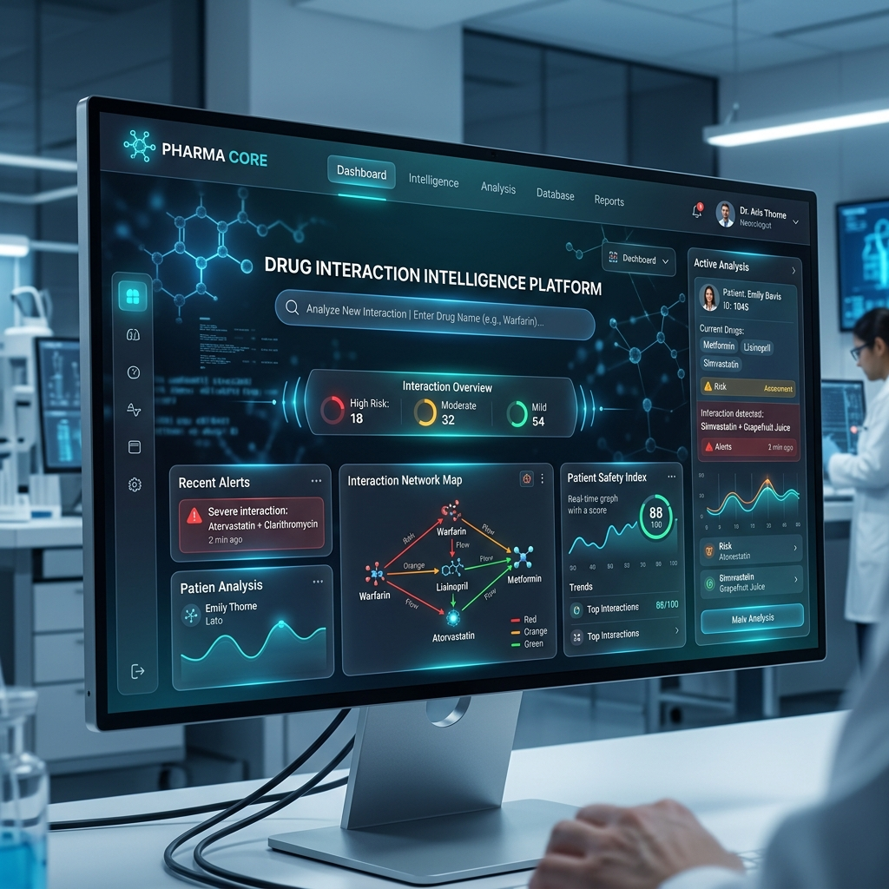

# 💊 PHARMA CORE - Drug Interaction Intelligence Platform

## 📖 About
**PHARMA CORE** is a next-generation clinical intelligence engine designed to predict, analyze, and explain complex Drug-Drug Interactions (DDI). By bridging the gap between classical Machine Learning (Logistic Regression) and state-of-the-art Generative AI (Google Gemini), it provides healthcare professionals with instant risk assessments and deep biological insights.

---

## 🛠️ Technologies

The platform is built using a modern, scalable tech stack:

- **Backend**: [FastAPI](https://fastapi.tiangolo.com/) (Python)
- **Frontend**: HTML5, Vanilla CSS (Glassmorphism UI), JavaScript (ES6+)
- **GenAI**: [Google Gemini Pro API](https://ai.google.dev/)
- **Machine Learning**: Scikit-Learn (Logistic Regression) & XGBoost
- **Database**: SQLite3 / SQLAlchemy
- **Data Processing**: Pandas
- **Containerization**: [Docker](https://www.docker.com/) & Docker Compose

---

## 🚀 Features

- **⚡ Real-time Predictive Engine**: Instant severity prediction (Severe, Moderate, Mild) using a Logistic Regression model with **83.2% accuracy**.
- **🧠 GenAI Clinical Explanations**: Powered by **[Google Gemini](https://ai.google.dev/)**, provides streaming, word-by-word clinical justifications for interaction risks.
- **🛡️ Glassmorphism UI**: A premium, futuristic dashboard built for high-performance clinical data visualization.
- **📜 Interaction History**: Persistent tracking of previous diagnostics for rapid clinical review.
- **📦 Scalable Architecture**: Fully containerized using Docker for seamless deployment across any environment.
- **🔄 Data Integration**: Robust pipeline to merge and process clinical interaction datasets.

---

## 🏁 The process running the project

Follow these steps to get the platform up and running on your local machine:

### 1. Clone the repository
```bash
git clone https://github.com/Monu034/Drug-Interaction-Intelligence-Platform.git
cd Drug-Interaction-Intelligence-Platform
```

### 2. Set up Environment Variables
Create a `.env` file in the root directory and add your Google Gemini API key:
```env
GOOGLE_API_KEY=your_gemini_api_key_here
```

### 3. Option A: Run with Python (Local)
Ensure you have Python 3.9+ installed, then run:
```bash
# Install dependencies
pip install -r requirements.txt

# Start the application
python -m app.main
```
The application will be available at `http://localhost:8000`.

### 4. Option B: Run with Docker (Recommended)
If you have Docker and Docker Compose installed:
```bash
docker-compose up --build
```
The application will be accessible at `http://localhost:8000`.

---

## 📊 Preview of small running at the end

Below is a preview of the **PHARMA CORE** intelligence dashboard in action, showcasing the glassmorphism interface and real-time clinical analysis.



> **Note**: The dashboard provides real-time streaming explanations of drug interactions, helping clinicians understand the underlying biological mechanisms.

---

<div align="center">
  <sub>Built with ❤️ by Monu Shaik for the Next Generation of Healthcare.</sub>
</div>
