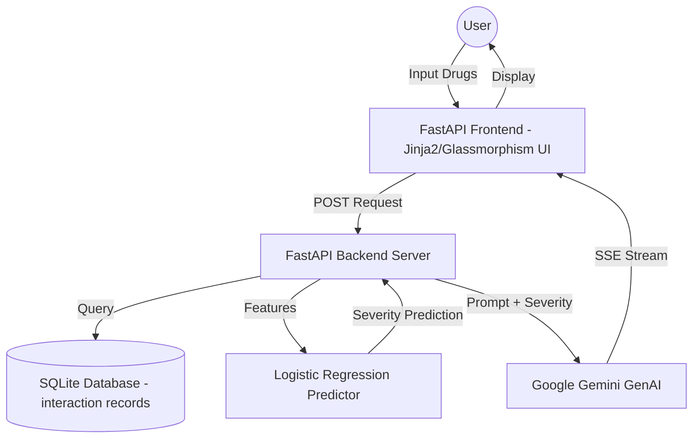

# 💊 PHARMA CORE - Next-Gen Drug Intelligence Platform


[](https://fastapi.tiangolo.com/)
[](https://www.python.org/)
[](https://ai.google.dev/)
[](https://www.docker.com/)
[](https://scikit-learn.org/)

**PHARMA CORE** is a high-performance clinical intelligence engine designed to predict, analyze, and explain complex Drug-Drug Interactions (DDI). By combining classical Machine Learning with state-of-the-art Generative AI, it provides clinicians and researchers with instant risk assessments and deep mechanical insights.

---

## 🚀 Key Features

- **⚡ Real-time Predictive Engine**: Instant severity prediction (Severe, Moderate, Mild) using a Logistic Regression model with **83.2% accuracy**.
- **🧠 GenAI Clinical Explanations**: Powered by **[Google Gemini](https://ai.google.dev/)**, provides streaming, word-by-word clinical justifications for interaction risks.
- **🛡️ Glassmorphism UI**: A premium, futuristic dashboard built for high-performance data visualization.
- **📜 Interaction History**: Persistent tracking of previous diagnostics for rapid clinical review.
- **📦 Scalable Architecture**: Fully containerized using **[Docker](https://www.docker.com/)** for seamless deployment.

---

## 🏗️ Technical Architecture

The platform follows a modern micro-service-ready architecture that bridges performance and intelligence.



### 🔬 Core Pillars

1.  **Data Engineering**: Robust pipeline using `Merge.py` to synthesize clinical datasets into a high-utility SQLite backend.
2.  **Machine Learning**: A specialized Logistic Regression model optimized for speed and clinical reliability.
3.  **Generative AI**: Integration with Google Gemini for automated, high-fidelity clinical report generation.
4.  **Product Design**: A focus on UX/UI using modern CSS techniques like glassmorphism and dynamic micro-animations.

---

## 🛠️ Tech Stack

- **Backend**: [FastAPI](https://fastapi.tiangolo.com/) (Python)
- **Frontend**: HTML5, Vanilla CSS (Glassmorphism), JavaScript (ES6+)
- **GenAI**: [Google Gemini Pro API](https://ai.google.dev/)
- **ML**: Scikit-Learn (Logistic Regression)
- **Database**: SQLite3 / SQLAlchemy
- **Containerization**: [Docker](https://www.docker.com/)

---

## 🏁 Getting Started

### Prerequisites

- Python 3.9+
- [Google Gemini API Key](https://aistudio.google.com/)
- Docker (Optional)

### Installation

1.  **Clone the repository**:
    ```bash
    git clone https://github.com/Monu034/Drug-Interaction-Intelligence-Platform.git
    cd Drug-Interaction-Intelligence-Platform
    ```

2.  **Set up Environment Variables**:
    Create a `.env` file in the root directory:
    ```env
    GOOGLE_API_KEY=your_gemini_api_key_here
    ```

3.  **Run with Python**:
    ```bash
    pip install -r requirements.txt
    python -m app.main
    ```

4.  **Run with Docker**:
    ```bash
    docker-compose up --build
    ```

---

## 🤝 Project Credits & Links

This project was built using industry-leading technologies:
- **[Google Cloud / AI](https://google.ai)** - Providing the intelligence bridge.
- **[FastAPI](https://fastapi.tiangolo.com/)** - The performance backbone.
- **[Docker](https://www.docker.com/)** - Ensuring reliability through containerization.

---

<div align="center">
  <sub>Built with ❤️ by Monu Shaik for the Next Generation of Healthcare.</sub>
</div>
